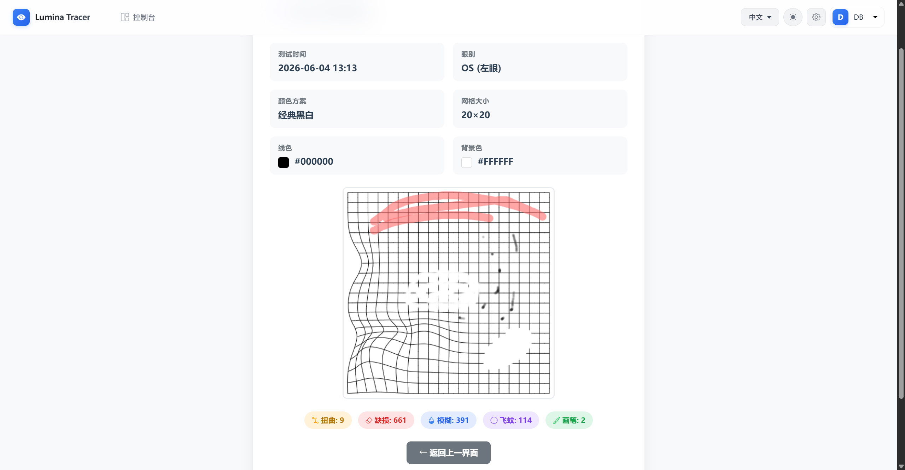
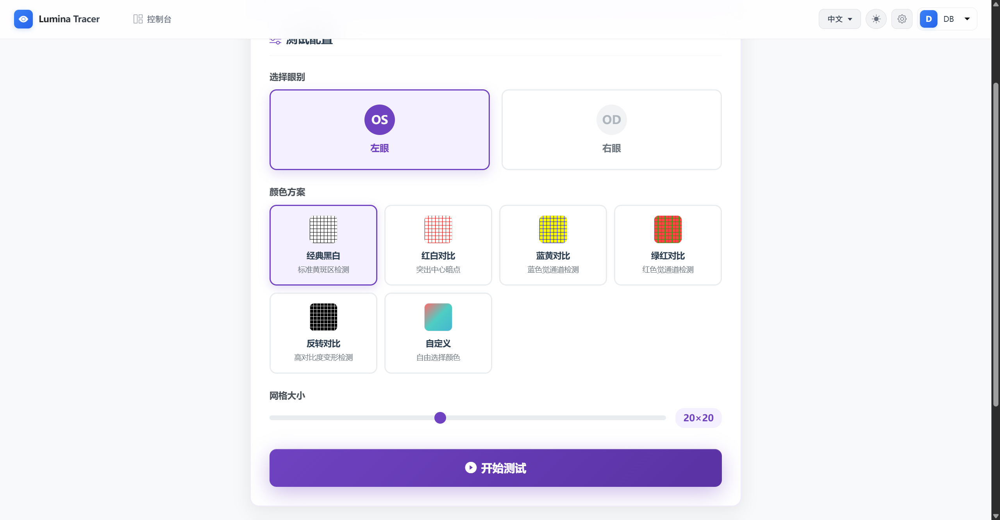
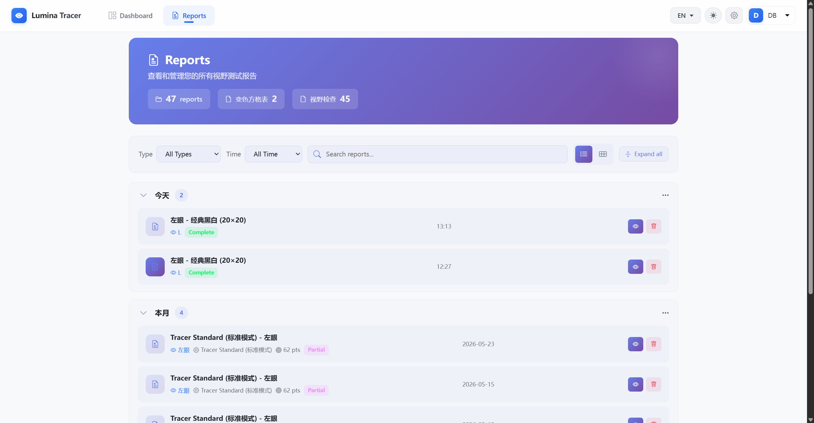
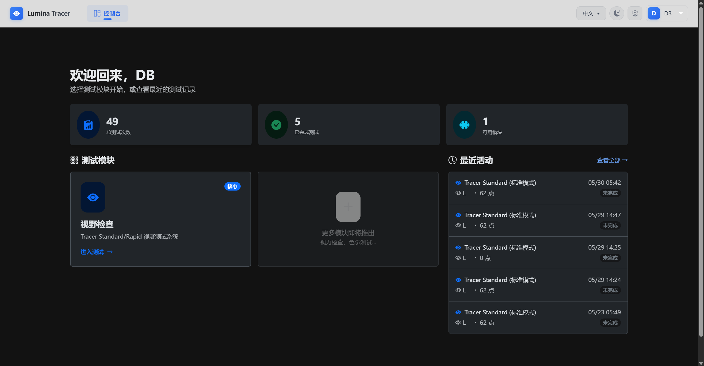
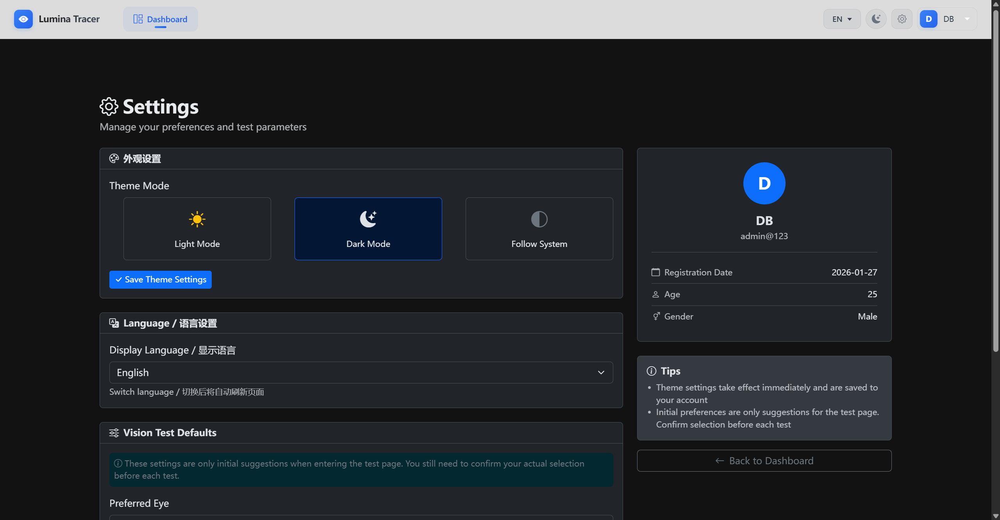
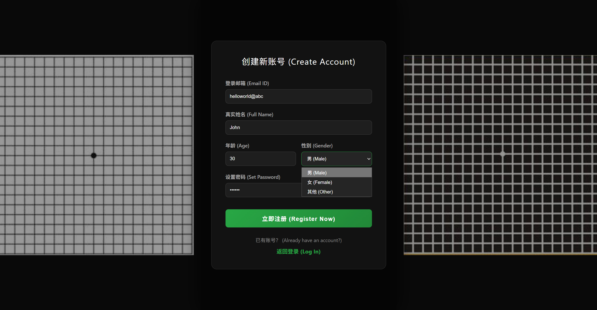
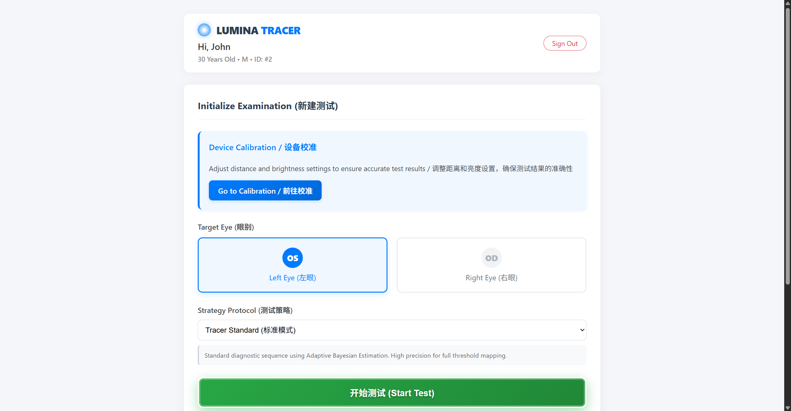

# Lumina Tracer

Language: [English](README_EN.md) | [中文](README_CN.md)

> A Web-Based Perimetry System

**Lumina Tracer** is an open-source, web-based automated perimetry system.
This project aims to explore the possibility of using standard computer monitors for low-cost visual field screening, providing a lightweight tool for ophthalmic research and preliminary screening.

> I am someone who has been plagued by eye problems. During my long journey seeking medical help, I discovered that the limited equipment in hospitals cannot actually meet patients' needs. For example, booking a visual field test often requires waiting for days. So, can we use home devices to achieve more flexible visual field testing?
Even though the hardware foundation of electronic screens cannot compare to professional Humphrey visual field analyzers, everyone can have more time and freedom to conduct tests.
I hope to explore the potential of electronic devices in ophthalmic testing.
Darkness may have already appeared before our eyes, which makes us yearn for light even more. This is why I named it "Lumina Tracer" (Light Chaser).
---

## ✨ Key Features

Currently, it should be able to intuitively reflect whether there are visual function impairments in the screen's visible range.

* Visual field testing based on modern electronic devices
* Reference testing based on past test records

### 📊 Analysis & Reporting
* **Visual Reports**: Automatically generates sensitivity numerical maps (Sensitivity Map) and grayscale maps (Grayscale Map).

### 🖥️ User Experience
* **User Dashboard**: Complete user profile management and historical test record review.

## 📊 Changelog

### v1.0.0
* Initial release
* Visual Field Testing: Basic visual field testing, similar to HFA machine testing process, testing for visual field defects
* Original Mode: Reference testing, based on past test results, detecting changes in current visual field compared to past tests
* Result Analysis: Provides sensitivity numerical maps and grayscale maps to help users understand test results
* User profile management, historical test record review, and other features

### v1.1.0
* Extended user dashboard and customization features, such as theme color selection
* More elegant code structure
* Visual Field Testing: Optimized testing process (better interference resistance)
* Multi-language support, currently supporting Chinese and English

### v1.2.0
* Test Record Management: More comprehensive test record management features. Supports categorized browsing and record marking.
* Color-variable Amsler Grid: An original new feature that implements a grid with customizable size and colors, allowing users to draw distortions, blurs, and other visual field issues, providing an intuitive way to reflect visual field conditions.

---

## 🚀 Installation & Running

### 📥 Ready to Use (Recommended)

No need to install any code environment, you can directly download the portable version, no installation required, out of the box:

1. **Download**: Go to the [Releases page](https://github.com/Boatbydan/LuminaTracer/releases) to download `LuminaTracer.zip` for your platform.
2. **Run**: Extract the files and double-click **`LuminaTracer.exe`** to start.

### 📥 Compile and Run
#### 1. Environment Preparation
Ensure your system has the following environment installed:
* **Python 3.8+**
* **C++ compiler** (Windows users need to install Visual Studio Build Tools to compile C++ extensions)

#### 2. Get the Code
```bash
git clone https://github.com/Boatbydan/LuminaTracer.git
cd LuminaTracer
```

#### 3. Installation Steps
```bash
# Install dependencies
pip install -r requirements.txt
```

## 📖 Usage Guide
* Video Tutorial: [LuminaTracer - Home Visual Field Testing Program](https://www.bilibili.com/video/BV1bLoDBeEWr)

After running **Lumina Tracer**, you will enter the login/registration page.
Registration: For first-time use, you can register with any email and password you like; there is no verification mechanism. The account must be in email format.

### 1. Operation Process (Visual Field Testing, v1.0.0+):
To obtain relatively accurate reference results, please follow the physical environment requirements below:
* Environment Preparation:
Keep the room dimly lit to avoid screen glare.
Keep your eyes at a distance from the screen, approximately allowing your visual field to cover the screen's short edge.
When testing the left eye, cover the right eye, and vice versa.

* Register/Login: Create a profile and fill in your age (this is crucial for calculating normative deviations (TODO: deviation calculation functionality is still being improved)).
* Start Test: Select the eye and other information on the dashboard.
* Operation: Always fixate on the cross in the center of the screen. When you sense a light spot flickering in your peripheral vision, immediately press the spacebar.
* View Report: After the test is completed, the system will automatically generate an analysis report.

### 2. Operation Process (Editable Color-variable Grid, v1.2.0+):
* Select Parameters: Enter the grid function module, choose the desired colors and grid size.
* Image Editing: Edit corresponding distortions, blurs, and other visual field issues on the grid.

### Feature Screenshots
* Video Tutorial: [LuminaTracer - Home Visual Field Testing Program](https://www.bilibili.com/video/BV1bLoDBeEWr)
* v1.2.0 - Color-variable Amsler Grid + Test Record Management

| Grid Editing | Grid Settings | Report Management |
|---------|---------|---------|
|  |  |  |

* v1.1.0 - Extended dashboard and multi-language support

| User Interface | Settings Interface |
|---------|---------|
|  |  |

* v1.0.0 - Registration, login, and visual field testing

| Register/Login | Prepare Test | Test & Report |
|---------------|-------------|---------------|
|  |  |  |
|  |  |  |

*Note: Images are arranged in the order of operation, from left to right, top to bottom: Sign Up → Sign In → Prepare Test → Start Test → Testing → View Report*

## 🚧 TODO
[*] Multi-language support
[ ] Multi-platform support
[ ] Scientific calibration method
[ ] Algorithm upgrade (improve normal visual field reference)
[ ] Report tracking and analysis
[ ] Camera eye tracking
[ ] UI optimization
[ ] 30-2 mode
[ ] Other features

## ⚠️ Disclaimer
This project is for research, educational demonstration, and non-clinical preliminary screening purposes only.

Lumina Tracer is not a professional medical diagnostic technology.
Due to limitations in display brightness, ambient light, and calibration factors, test results may have deviations. If you notice vision abnormalities, visual field defects, or any eye discomfort, please go to a regular hospital for examination.

## 📄 License
This project is open source under the MIT License.
