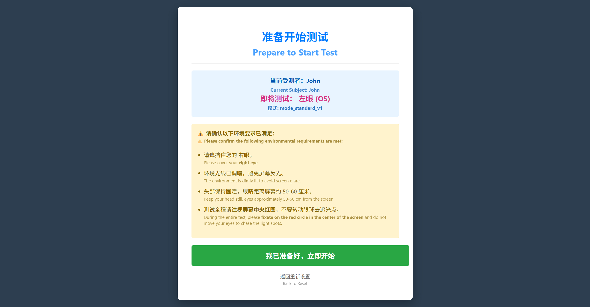
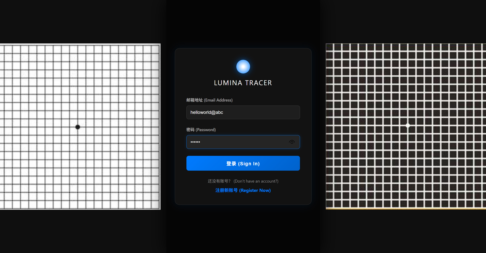
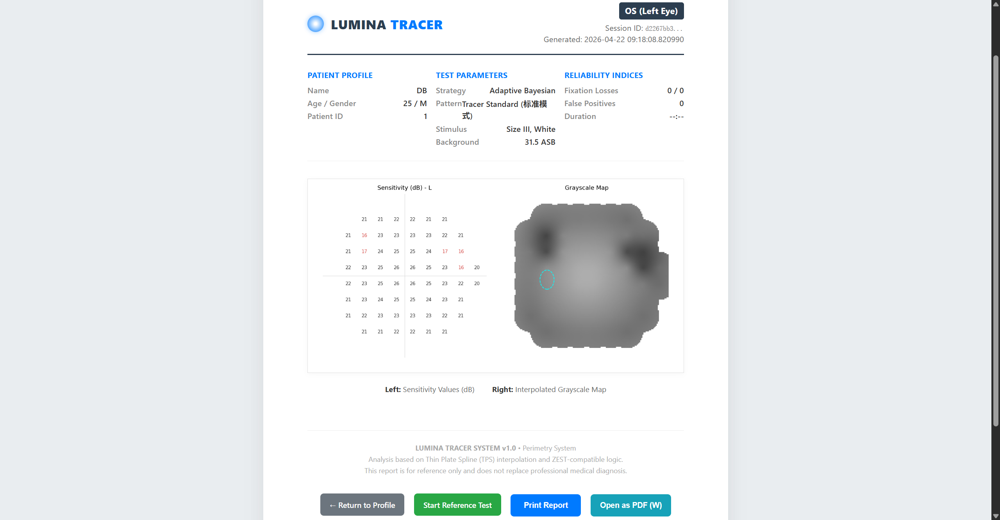

# Lumina Tracer

选择语言: [English](README_EN.md) | [中文](README_CN.md)

> A Web-Based Perimetry System

**Lumina Tracer** 是一个开源的、基于 Web 的自动视野检查系统。
本项目旨在探索利用标准计算机显示器进行低成本视野筛查的可能性，为眼科科研与初步筛查提供一个轻量级的工具。

> 我是个饱受眼部问题困扰的人。在漫长的求医过程中，我发现医院有限的设备事实上无法满足患者的需求。例如预约一次视野检查动辄需要等待多天。那么我们是否能够利用家用的设备实现更加自由的视野检测呢？
即使电子屏幕的硬件基础无法比较专业的Humphrey视野分析仪，但是每个人可以有更多的时间，更多的自由来进行测试。
我希望能够挖掘出电子设备在眼科测试方面的潜力。
我们的眼前或许已经出现了黑暗，这让我们更加渴望光明。这是我将其命名为追光者的原因。
---

## ✨ 核心功能 (Key Features)

目前应可直观地反映是否存在对屏幕可见范围的视功能障碍。

* 基于现代电子设备的视野测试
* 基于过去测试记录的参考测试

### 📊 报告与分析 (Analysis)
* **可视化报告**: 自动生成敏感度数值图 (Sensitivity Map) 与灰度图 (Grayscale Map)。

### 🖥️ 交互体验 (Experience)
* **用户仪表盘**: 完整的用户档案管理与历史测试记录回溯。

---

## 🚀 安装与运行 (Installation)

### 📥 立即使用 (推荐)

无需安装任何代码环境，可直接下载绿色版，免安装，开箱即用：

1.  **下载**: 前往 [Releases 页面](https://github.com/Boatbydan/LuminaTracer/releases) 下载对应平台的 `LuminaTracer.zip`。
2.  **运行**: 解压后双击 **`LuminaTracer.exe`** 即可启动。

### 📥 编译运行
#### 1. 环境准备
确保您的系统已安装以下环境：
* **Python 3.8+**
* **C++ 编译器** (Windows 用户需安装 Visual Studio Build Tools 以编译 C++ 扩展)
> **注意**: 本项目目前主要在 Windows 10/11 环境下进行测试，Linux/macOS 平台的兼容性测试正在准备中。

#### 2. 获取代码
```bash
git clone [https://github.com/Boatbydan/LuminaTracer.git](https://github.com/Boatbydan/LuminaTracer.git)
cd LuminaTracer
```

#### 3. 安装步骤
```bash
# 建议创建虚拟环境 (确保 python 版本为 3.10)
python -m venv venv
venv\Scripts\activate

# 安装依赖
pip install -r requirements.txt
```

## 📖 使用指南 (Usage)
运行 **Lumina Tracer** 后，会进入登录/注册页面。
第一次使用可以随便注册喜欢的账号密码，并没有检测机制。账号需以邮箱形式。

为了获得相对准确的参考结果，请严格遵守以下物理环境要求：

环境准备:

保持室内光线昏暗，确保屏幕无反光。
保持眼睛距离屏幕约 50-60cm。
测试左眼时请遮盖右眼，反之亦然。

### 运行流程:

* 注册/登录: 建立档案，填写年龄（这对于计算常模偏差至关重要(TODO: 偏差的计算功能还在完善)）。
* 开始测试: 在仪表盘选择眼别与其他信息。
* 操作: 始终注视屏幕中央的十字。当您的余光感觉到有光点闪烁时，立即按下 空格键。
* 查看报告: 测试结束后系统将自动生成分析报告。

### 运行流程截图

| 注册/登录 | 准备测试 | 测试与报告 |
|---------|---------|-----------|
|  |  |  |
|  |  |  |

*注：图片按照运行顺序排列，从左到右、从上到下依次为：注册 → 登录 → 准备测试 → 开始测试 → 测试中 → 查看报告*

## 🚧 TODO
[ ] 多平台支持
[ ] 多语言支持
[ ] 科学的校准方法
[ ] 算法升级 (完善正常视野的参考)
[ ] 报告跟踪与分析
[ ] 摄像头视线追踪
[ ] UI优化
[ ] 30-2模式
[ ] 其他功能

## ⚠️ 免责声明 (Disclaimer)
本项目仅供科研、教学演示及非临床的初步筛查使用。

Lumina Tracer 不是专业的医疗诊断技术。
受限于显示器亮度、环境光线及校准因素，测试结果可能存在偏差。如果您发现视力异常、视野缺损或有任何眼部不适，请务必前往正规医院进行检查。

## 📄 许可证 (License)
本项目基于 MIT License 开源。